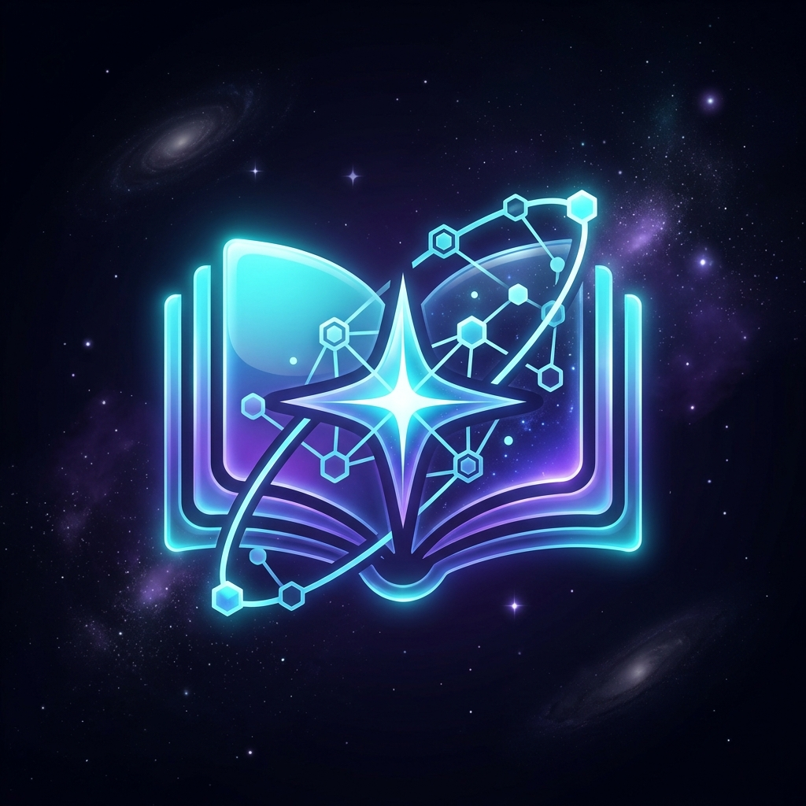
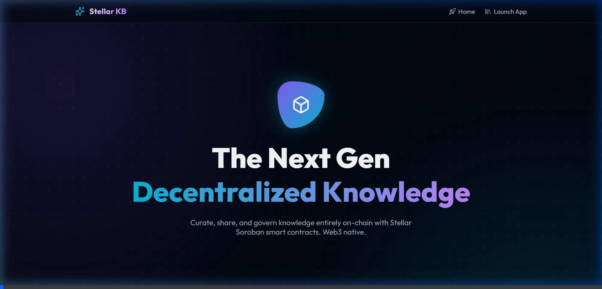
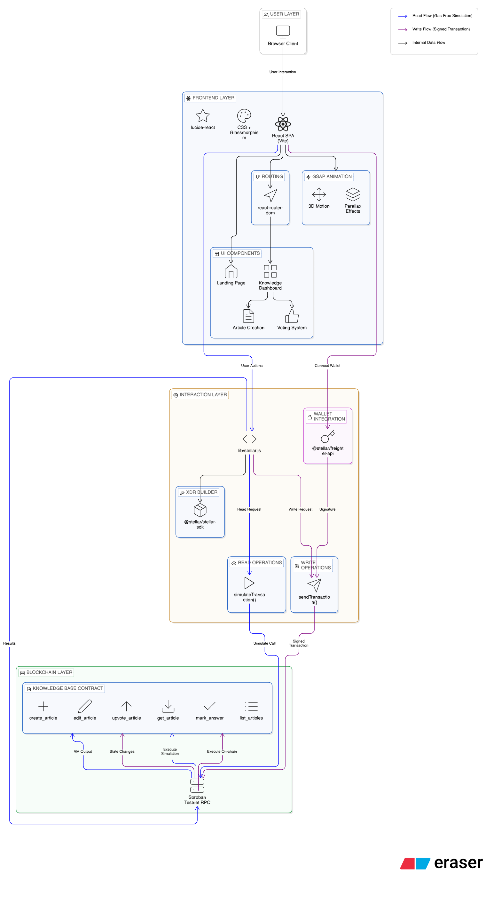

<div align="center">
  
  <br/><br/>
  
  # Stellar Knowledge Base 🌌
  **Decentralized, Immutable, Community Governed On-Chain Knowledge.**

  [](https://stellar.org/soroban)
  [](https://vitejs.dev/)
  [](https://reactjs.org/)
  [](https://greensock.com/)

</div>

<hr/>

## 🎬 Project Walkthrough

Watch the application in action with our custom 3D Web3 user interface:



*(Click to view, or download `demo.webp` to view the full recorded interaction flow).*

## 🌟 Overview

The **Stellar Knowledge Base** is a next-generation decentralized application (dApp) built on the **Stellar Soroban** smart contract platform. It acts as an immutable wiki where community members can create, curate, and govern informative articles, tutorials, and documentation entirely on-chain. 

Unlike traditional databases, every entry, edit, and upvote is securely cryptographically finalized on the Stellar network, ensuring 100% transparency and resistance to censorship.

## 🏗️ System Architecture



The project architecture is bifurcated into a high-performance modern Web3 frontend and a secure smart-contract-driven backend.

### 1. Frontend Layer
- **Framework:** React.js powered by Vite for lightning-fast HMR and build performance.
- **Routing:** Component-based client routing achieved through `react-router-dom`, maintaining seamless SPA experiences.
- **UI/UX Aesthetics:** 
  - Glassmorphic translucent surfaces tailored for the "Web3 Cosmic" theme.
  - Immersive 3D motion and parallax transitions using **GSAP** (`@gsap/react`).
  - Clean vector iconography implemented natively via `lucide-react`.

### 2. State & Blockchain Interaction Layer
- **Wallet Connection:** Real-time seamless Freighter extension connection bridging the user matrix to the Soroban testnet (`@stellar/freighter-api`).
- **Data Execution:** Utilizing `@stellar/stellar-sdk` to structure the binary `xdr` encoded transactions.
- **RPC Invocation**: Data reading occurs completely gas-free via `simulateTransaction` while mutative writes are successfully signed by Freighter and propagated using `sendTransaction` endpoints pointing to `https://soroban-testnet.stellar.org`.

### 3. Smart Contract Backend 
*Contract Hash:* `CDHZYEFKNTGBUOUSCJS2T7JASGHPCZIC2Y37BOWD537NSFLXLQQSLFJT`
Written natively in Rust for the Soroban WASM runtime, the backend implements the following structural logic points:
- `create_article`: Initializes standard payload struct (Title, Content, Author).
- `edit_article`: Facilitates mutable modifications tracked securely bounding the payload footprint.
- `upvote_article` & `mark_answer`: Enables decentralized community governance of information relevance.
- `list_articles` & `get_article`: High-efficiency read functions querying the Ledger entries directly.

---

## 🚀 Getting Started

To operate this project or run your own instance locally:

### Prerequisites
1. **Node.js** (v18+)
2. **Freighter Wallet Extension** mapped to the Stellar Testnet.

### Installation

```bash
# Clone the repository
git clone https://github.com/pratyush06-aec/knowledge-base.git
cd knowledge-base/my-stellar-app

# Install package dependencies
npm install

# Run the local development server locally
npm run dev
```

Navigate to `http://localhost:5173` to explore the Stellar Knowledge Experience!

## 🔐 Contact & Contributions
Feel free to open Issues or Pull Requests on the github if you have an idea to refine the Stellar architecture!
